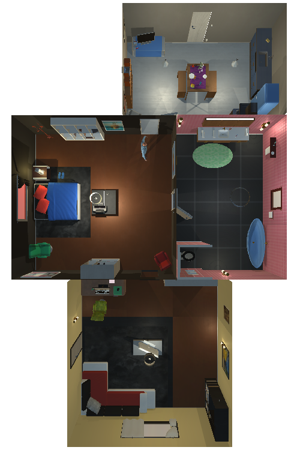

# VirtualHome
VirtualHome is a platform to simulate complex household activities via Programs. Given an initial environment describing an apartment and a program depicting a sequence of actions, VirtualHome executes the program generating a video of the activity together with useful data for activity understanding or planning.

Check out more details of the environmnent and platform in [virtualhome.org](). VirtualHome has been used in:

- VirtualHome: Simulating HouseHold Activities via Programs
- Synthesizing Environment-Aware Activities via Activity Sketches


PUT HERE A GIF?

## Dependencies

```
Write here the dependencies
```

## QuickStart
Clone the repository and download the simulator

```
git clone https://mboben@bitbucket.org//virtualhome.git
instructions to copy the executable
```

Run `sh run_example.sh` to generate an example activity video. You can find the generated video in `folder_name`. You can check more examples [here]().


## Examples
For how to use the code, see `example.py` file.
Example scripts are located in `example_scripts` folder

## Environment
VirtualHome is composed of 7 scenes where activities can be executed. Each scene is encoded in a .json file containing a node for every object and edges between them representing relationships. They can be modified through the corresponding json file. 

The files representing each apartment can be found in `example_graphs`. 

Check `example_scripts/` for examples on how to read and update graphs.

| Scene 1   | Scene 2   | Scene 3   | Scene 4   | Scene 5   | Scene 6   | Scene 7  |
| ------------- | ------------- | ------------- | ------------- | ------------- | ------------- |------------- |
|  | | | | | | 


## Programs
Activities in VirtualHome are executed through programs. Each program is a sequence of instructions representing atomic actions that the agent will execute. Each program is stored in a .txt file with the following format. 

```
Program title
Program description


[ACTION_NAME] arg1 arg2
[ACTION_NAME] arg1 arg2
...
```
Where each argument has the format `<OBJECT_NAME> (ID_OBJECT)`. The number of arguments depends on the action type. The programs can also have a precondition file, specifying the state of the objects before the program is executed.

You can view the supported actions, objects and preconditions in [Resources]().


### Dataset
We collected a dataset of programs to execute in the environment. You can download them in [link to programs](). 
Once downloaded, move programs into the `data` folder. The data should follow the following structure:

```
data
└── programs_processed_precond_nograb_morepreconds
	|── initstate
	├── withoutconds
	├── executable_programs
	|   ├── TrimmedTestScene7_graph
	|	└── ...
	└── state_list
		├── TrimmedTestScene7_graph
	   	└── ...	
```

Where `withoutconds` and `initstate` contain the original programs and pre-conditions. 

To view a script executed in an enviornment, check `executable_programs/{environment}/{script_name}.txt`. 

To view the graph of the environment throughout the script execution of a program, check   `state_list/{environment}/{script_name}.json`.

### Script generation
A program can be executed in multiple scenes. Depending on the scene where the script is executed, it will be matched to different objects and generate a different sequence of graphs. To execute a script in a given scene, run:

```

```


### Script augmentation

The original programs can be extended by replacing objects or perturbating the environment. You can find more details about how it is extended in [our paper](). To augment the dataset run.

```
cd dataset_generation
python augment_dataset_affordances.py
python augment_dataset_locations.py

```  


## Videos and Frames
VirtualHome allows generating videos corresponding to an activity and frames corresponding to a snapshot of the environment state.

### Generating videos

The following files will be generated

Check [examples](#Examples) for more details

### Frames
 

## Resources
Contains resource files used to initialize the environment, set properties of objects and generate videos given the scripts. Check the folder for a description of its contents.

